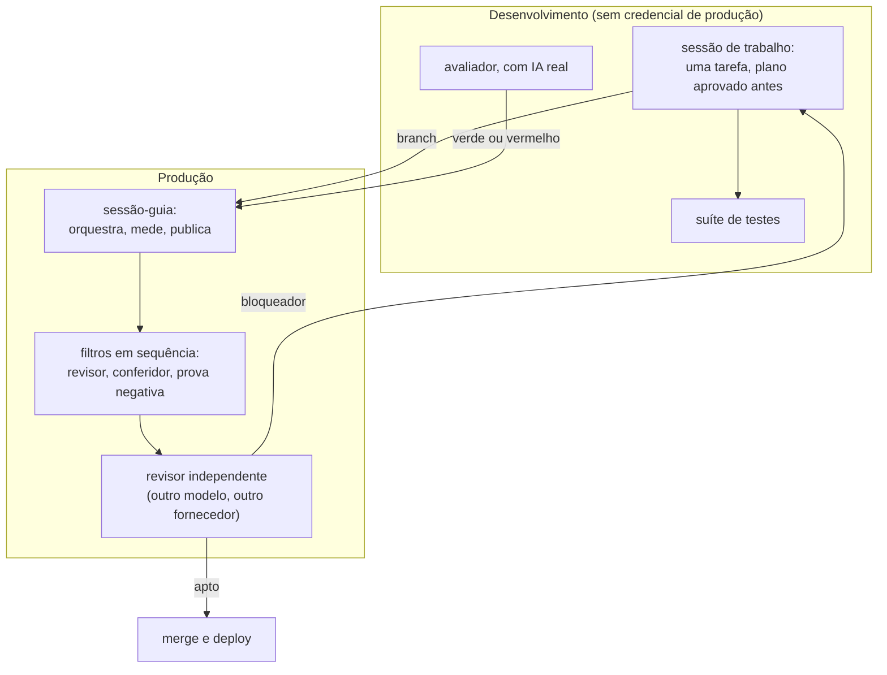
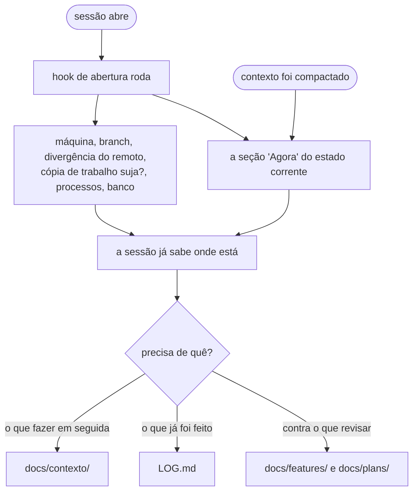

# Como este projeto é construído

Uma pessoa dirige agentes de IA para escrever e operar um assistente de
agendamento por WhatsApp que está em produção desde agosto de 2026, atendendo
negócio real. Este repositório é o arranjo que torna esse trabalho verificável:
os papéis, os filtros, as regras e o incidente que produziu cada uma.

**O que ele não é.** Não é coleção de prompt, não é kit para instalar, não é
receita. As regras aqui são deste projeto e não se aplicam sozinhas a outro. O
que se leva é o método de chegar a elas: cada regra nasceu de uma falha
específica, com data, e o custo dela está escrito ao lado.

**Irmãos:** [`sofia-vitrine`](https://github.com/andrenv14/sofia-vitrine), a
arquitetura do produto · [`sofia-eval`](https://github.com/andrenv14/sofia-eval),
a avaliação de comportamento do modelo ·
[`riachotech-site`](https://github.com/andrenv14/riachotech-site), o site.

## Mapa

| Onde | O que tem |
|---|---|
| [`AGENTS.md`](AGENTS.md) | a constituição: o que toda sessão lê antes de tocar em qualquer coisa |
| [`.claude/`](.claude/) | o que o harness lê: agentes, hooks, skill de deploy, permissões |
| [`uma-volta/`](uma-volta/) | uma fatia inteira, do plano ao parecer que liberou o merge |
| [`memoria/`](memoria/) | o que um agente aprendeu entre execuções |
| [`docs/`](docs/), [`ESTADO.md`](ESTADO.md), [`LOG.md`](LOG.md) | como o contexto é particionado |

Os arquivos de `.claude/` e de `memoria/` são os reais, sem edição. O
`AGENTS.md` é extração curada de um repositório privado: saíram endereço de
máquina, credencial, nome de cliente e o que é do produto. Ficaram as regras,
os incidentes e as datas.

## 1. O arranjo

**Papéis fixos, e nenhum acumula dois.**

| Papel | O que faz | O que nunca faz |
|---|---|---|
| Sessão-guia | orquestra, mede, dispara os filtros, faz merge e deploy | implementar |
| Sessão de trabalho | uma por vez, cópia própria do código, plano aprovado antes da primeira linha | revisar o próprio diff |
| Sessão do avaliador | roda o avaliador de comportamento com IA real | tocar o código de produção |
| Subagentes | revisar diff, conferir citações, prova negativa, auditar infra e documentação | decidir merge |
| Revisor independente | lê a branch inteira e declara "apto a deploy" ou devolve o bloqueador | implementar qualquer coisa |

As duas máquinas são separadas por segurança. Uma é produção e atende cliente
pagante. A outra roda a suíte e o avaliador, e não tem nenhuma credencial de
produção: token de plataforma falso, banco de teste, chave de modelo com teto
próprio.

## 2. Modelos e esforço

O papel é a arquitetura. O modelo que o cumpre é implementação, e muda.

**O requisito é este:** existe uma segunda revisão, independente de quem
implementou, que decide o merge e nunca implementa. Qual modelo faz isso é
detalhe de configuração.

O que cumpre cada papel hoje, medido em 07/09/2026 (o esforço é o controle de
raciocínio do Claude Code; "esforço máximo" é o topo da escala):

| Papel | Modelo | Esforço | Por quê |
|---|---|---|---|
| Implementação | Opus 5 | xhigh | código de longo horizonte é a curva íngreme: medido, cair para médio custa ~2 pontos de rubrica, e baixo custa ~8 |
| Tarefa mecânica (merge, deploy, edição já decidida) | Sonnet 5 | alto (padrão) | passo com roteiro não melhora com esforço extra |
| Decisão (arquitetura, spec, bug que não reproduz) | Fable 5.1 | máximo | é o único caso medido em que cada degrau de esforço compra qualidade, ~2,4 pontos por degrau. **Fable nunca implementa** |
| Revisão independente | `gpt-6-astra` | xhigh | outro fornecedor, e o sandbox só-leitura torna "nunca implementa" garantia mecânica em vez de promessa de prompt |

Subagente herda o esforço de quem o dispara, salvo declaração no frontmatter —
por isso cada agente em [`.claude/agents/`](.claude/agents/) declara o seu. Os
de leitura e relatório ficam em médio: curva plana, empataram com o padrão por
70–85% do custo.

Este número saiu de `~/.codex/config.toml` na máquina onde a revisão roda, no
dia em que escrevi. **Não escrevo modelo de memória:** no mesmo dia as duas
máquinas tinham modelos diferentes na configuração, e a lembrança apontava para
a errada.

Uma distinção que confunde quem lê rápido: o modelo que **atende o cliente** é
outro assunto, escolhido por custo e latência, e não tem relação com os daqui.

## 3. Como o contexto chega, e como ele fica pequeno

Metade do arranjo é isto. Um agente só é confiável se o que ele acredita sobre
o mundo estiver certo na abertura, e se o que ele precisa ler couber.

**A chegada.** O hook de abertura
([`.claude/hooks/estado.sh`](.claude/hooks/estado.sh)) entrega o estado sem
depender de alguém lembrar de buscá-lo. Ele existe porque em dois dias quatro
prompts de sessão foram escritos com estado desatualizado: branch errada em
checkout duas vezes, diário fora de ordem, e "branch pushada" afirmado com o
remoto três commits atrás. A regra de verificar antes de propor já existia; o
que faltava era o estado **chegar**. O mesmo hook reinjeta o estado corrente
depois de uma compactação de contexto, que é o momento em que a sessão mais
esquece.

**A partição.** Cada arquivo declara o que vai nele e o que NÃO vai, com
ponteiro para o irmão certo. É isso que permite ler um arquivo em vez de cinco.
Estado corrente ([`ESTADO.md`](ESTADO.md)) separado do diário
([`LOG.md`](LOG.md), com meses anteriores arquivados). O que fazer em seguida
separado do que já foi feito. Negócio, implantação e carreira em arquivos
próprios. Plano aprovado versionado. Spec por feature, que é contra o que o
revisor lê.

Dois incidentes fizeram essa partição existir. O estado corrente chegou a 462
linhas com 57 itens, quase todos de trabalho fechado uma semana antes, e um
mesmo assunto aparecia três vezes com estados contraditórios, porque nada nunca
saía: a poda virou parte do contrato do arquivo, com teto declarado. E a fila
carregava o que já estava feito, o que a fazia crescer sem parar sendo lida por
toda sessão: os concluídos foram para um arquivo próprio, com a medição que
justificou fechar cada um, porque sem ela a objeção volta com outra roupa duas
semanas depois.

O que é estável é a partição por finalidade com roteamento explícito. O corte
atual dos arquivos é o de uma data, e já mudou.

## 4. As regras, e o que cada uma custou

O eixo. Estas são as que têm o incidente mais nítido; o
[`AGENTS.md`](AGENTS.md) carrega todas.

**Concordar não é corroborar.** Duas coisas só são duas fontes se puderem
discordar. Se uma deriva da outra, ou as duas vieram da mesma origem, é uma
fonte contada duas vezes, e a confiança que ela produz é falsa. Apareceu em
lugares que não se pareciam: um `pgrep` que casa a própria linha de comando e
dá positivo em si mesmo, duas sessões no mesmo dia; uma consulta ao banco que
conta a própria conexão, então "livre" nunca aparece; duas sessões que trocaram
argumentos e convergiram, duas vezes, e as duas para o lado errado. A cura não
é lembrar da lista: **medição que pode incluir o medidor tem de excluí-lo no
comando**, não na interpretação.

**Verificação que passa observando nada precisa primeiro ser vista falhar.**
"Nenhum agendamento criado" é satisfeito pelo comportamento certo e também pelo
sistema não ter rodado. Cinco instâncias em três sessões no mesmo dia, e a
sexta no dia seguinte: uma guarda legítima converteu um erro do avaliador em
verde, e o cenário passou com o modelo não respondendo nada, duas chamadas e
zero token. **Zero medido não é controle positivo.**

**Premissa tratada como verificação não é pega pelo autor.** Sete casos, sete
pegos por outra pessoa ou por outro filtro, nenhum pelo próprio autor. Quem
escreveu não relê o que escreveu, relê o que quis dizer. É por isso que o
pipeline de filtros é **cobertura**, e não só uma forma de não disputar
recurso: o que ele cobre é o ponto cego de quem escreveu, e por isso fatia
pequena não dispensa filtro.

**Citação durável cita arquivo e nome, nunca número de linha.** Nome sobrevive
a deslocamento; `file:line` envelhece em silêncio, e uma fatia deslocou ~25
linhas de uma vez. `file:line` continua valendo para achado de revisão, que é
lido na hora.

**Contagem em texto durável envelhece na primeira mudança e não avisa ninguém.** Número
que descreve o código envelhece na primeira mudança e não avisa ninguém. Numa
fatia só, três instâncias: laços de payload contados errado pela sessão E pelo
revisor, independentemente, **minutos depois de o revisor avisar a sessão sobre
essa exata armadilha**; uma contagem de commits que mudou por causa do commit
que corrigia a contagem; e usos de um helper contados a mais porque o `grep -c`
contou o import junto. Troque o número por um invariante que se verifique
sozinho. Quando ele for inevitável, escreva ao lado o comando que o rederiva.

**Antes de podar um número, separe descritivo de normativo.** A regra acima
mata a contagem que muda sem ninguém decidir. O número normativo é o oposto:
ele **é** a regra, e só muda de propósito. Um teto de três correções, um prazo,
uma margem. A mesma tesoura nos dois afrouxa a regra em silêncio: uma poda
levou junto um teto, que virou uma frase mais ampla e mais vaga, e nada acusou.
Teste de uma pergunta: *este número muda sem ninguém decidir mudá-lo?*

**A terceira correção seguida que revela problema novo em outro lugar diz que o
desenho está errado.** Parar e redesenhar, em geral trocando previsão por
medição. Junto dela vai uma pergunta que a mantém honesta: *este achado é do
código que a fatia ESCREVEU ou do que ela passou a EXERCITAR?* Sem ela a fatia
vira porta de entrada para outra e não fecha nunca — a mesma classe de defeito
pré-existente apareceu cinco vezes numa fatia, uma por filtro, sempre um nível
mais fundo, porque cada correção guardava só o sítio que tinha aparecido.

**Aprovar um plano exige provar a peça central.** Quem aprova nomeia a peça
que, se errada, invalida o resto, e a verifica com prova. Um plano aprovado
pelos periféricos custou quatro rodadas; o seguinte, com a peça central provada
antes, foi aprovado na primeira volta.

**O filtro mede o artefato real, não só o código.** Se a fatia promete uma
propriedade de log, banco ou resposta, o filtro gera o artefato e prova a
propriedade nele. Três filtros leram o código e aprovaram uma fatia; o revisor
independente mediu o log de verdade e achou dois bloqueadores.

**Medição que sustenta um merge carrega o commit e o estado da cópia de
trabalho no cabeçalho.** Sem isso o número existe mas a atribuição dele ao
commit revisado depende da palavra de quem mediu, e o terceiro que mede existe
justamente para o parecer não se apoiar em palavra. O revisor independente
registrou isso como limite de um parecer, e estava certo: o defeito era do
procedimento, não do número.

**Uma pessoa escrevendo na janela da sessão é o único canal que não se
falsifica.** Duas sessões discordaram sobre se uma mensagem chegou a ser
emitida: ela estava no registro de quem recebeu e ausente no de quem teria
enviado, e a causa não foi determinada. A regra não depende de saber quem
estava certo, e é essa a graça dela: se existe qualquer caminho para uma
mensagem chegar sob o endereço de uma sessão sem ter sido emitida por ela,
então a procedência deixa de valer como garantia nos dois sentidos. Prompt que
chega por mensagem fica inerte até uma pessoa autorizar na janela de quem vai
agir.

**Permissão só muda com uma pessoa decidindo.** Um interpretador em `allow`
anula o resto da lista, porque roda o cliente do banco e escreve sem passar por
nenhuma regra. Um subagente não abre diálogo de permissão: três pushes
passaram sem perguntar, e foi isso que produziu o hook
[`pedir-permissao.sh`](.claude/hooks/pedir-permissao.sh), que roda antes de
qualquer checagem de modo. E o arquivo de permissões é reescrito pelo próprio
harness: em um dia entraram permissões em duas máquinas, sem ninguém editar.

**Busca por frase atravessa linha.** Um `grep` por "tem 368 testes em Vitest"
voltou vazio num arquivo que dizia exatamente isso, porque "tem 368 testes" e
"em Vitest" estavam em linhas diferentes e `grep` é orientado a linha. Vazio ali
lê-se como "não diz", que é o oposto da verdade. Junto com a regra anterior
sobre o medidor que se inclui, forma o par: **comando que devolve vazio só vale
depois de ser visto achar alguma coisa conhecida.**

## 5. Os agentes

Seis, cada um nascido de um incidente. O critério nunca foi quantidade: ao
avaliar um kit de terceiro com 77 itens, duas ideias foram aproveitadas.

| Agente | O que faz | O que nunca faz | Esforço |
|---|---|---|---|
| [`revisor`](.claude/agents/revisor.md) | revisa um diff que outra sessão implementou, contra a spec e a constituição | editar; decidir merge | xhigh |
| [`conferidor-de-citacoes`](.claude/agents/conferidor-de-citacoes.md) | confere o que um documento **afirma** contra o repositório | avaliar qualidade de código | alto |
| [`prova-negativa`](.claude/agents/prova-negativa.md) | roda os testes novos contra o código ANTES da correção, para provar que falham | tocar a cópia de trabalho principal | alto |
| [`auditor-vps`](.claude/agents/auditor-vps.md) | auditoria de leitura da infraestrutura | `sudo`; escrever; propor comando de escrita | médio |
| [`auditor-de-docs`](.claude/agents/auditor-de-docs.md) | classifica cada documento em vivo, desatualizado, morto ou duplicado | editar; sugerir edição pronta | médio |
| [`leitor-de-logs`](.claude/agents/leitor-de-logs.md) | lê logs de produção e devolve só anomalias | imprimir telefone ou conteúdo de mensagem | médio |

O `conferidor` é o exemplo de agente que mudou por medição. Até 06/09 ele
conferia se o `arquivo:linha` existia, e passou "100% das citações conferem" na
mesma volta em que o revisor independente achou quatro frases falsas no mesmo
documento. Instrumento que não media o que importa. Hoje ele confere quatro
coisas com veredito próprio: citações, contagens rederivadas por comando,
quantificadores sem exceção nomeada, e uma passada de verdade nas frases que
descrevem funções tocadas pelo diff.

## 6. Os hooks

Três, e o contrato é o mesmo nos três: **só leitura, nunca afrouxam permissão,
e degradam com mensagem própria em vez de abortar a sessão.** O cabeçalho de
cada um diz por que existe, com data.

- [`estado.sh`](.claude/hooks/estado.sh) entrega o estado na abertura. Sai
  sempre com zero, porque travar a abertura seria pior que a informação faltar.
- [`pedir-permissao.sh`](.claude/hooks/pedir-permissao.sh) intercepta escrita
  em produção antes de qualquer checagem de modo. Em erro de leitura, não
  imprime nada: a decisão volta para as listas normais, nunca para "pode".
- [`protege-arquivos.sh`](.claude/hooks/protege-arquivos.sh) bloqueia edição de
  arquivo com segredo ou de estado interno do git.

## 7. Uma volta real

[`uma-volta/`](uma-volta/) tem uma fatia inteira: o plano com a peça central
nomeada, o relato, e as quatro idas ao revisor independente com o que ele
respondeu em cada uma. Três bloqueadores e um "apto a deploy".

O que vale ver ali: **nenhum dos três bloqueadores foi lógica errada.** Os três
foram texto durável afirmando o que o código não fazia. Um limite que omitia
uma exceção que o próprio sistema produz; um gatilho declarado que não
correspondia ao sinal real; e um critério que foi reescrito de memória quando
devia ter sido copiado. Esse terceiro produziu a regra de que o relato copia o
critério do plano com nota de cópia.

## 8. Números

Medidos em 07/09/2026, com o comando que os rederiva na origem.

| | | comando |
|---|---:|---|
| agentes | 6 | `ls .claude/agents/*.md \| wc -l` |
| planos aprovados versionados | 16 | `ls docs/plans/*.md \| wc -l` |
| pareceres do revisor independente, desde 30/08 | 57 | `ls ~/para-revisao/parecer-codex-*.md \| wc -l` |
| linhas da constituição na origem | 896 | `wc -l AGENTS.md` |

**O custo é real e vale dito.** Uma volta ao revisor independente consome 60 a
77 mil tokens, porque ele lê a constituição inteira, o plano e o relato, e roda
a suíte. Em 07/09 foram oito disparos e a conta bateu o limite de uso duas
vezes. Quase todas as voltas daquele dia foram por texto, não por código.

## 9. Escopo

Isto mostra um caso real, não um framework. Não é portátil sem adaptar, e
generalizá-lo seria outro produto, sem ninguém pedindo.

Os modelos nomeados são os da data e vão mudar; o que não muda é a exigência de
uma segunda revisão independente de quem implementou. As regras são deste
projeto, com estas ferramentas e este tamanho de time, que é uma pessoa.

O material aqui é extração de um repositório privado. Saíram endereço de
máquina, credencial, nome de cliente e o que é do produto e não do processo.
Ficaram as regras, os incidentes e as datas.
